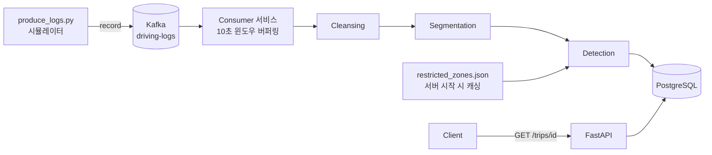

# 차량 운행 로그 분석 시스템

차량의 Raw 로그 데이터를 수신하여 데이터 정합성을 확보하고 주행 패턴을 분석하는 백엔드 시스템입니다.

## 아키텍처



## 실행 환경

- Python 3.11 이상 / Docker

## Docker로 실행 (권장)

```bash
# 1. 환경변수 설정
cp .env.example .env

# 2. 전체 서비스 실행 (app + PostgreSQL + Kafka + consumer)
docker compose up --build
```

## 실시간 스트리밍 테스트

```bash
# 1. docker compose up 후 새 터미널에서 producer 실행
# driving_log.json을 Kafka 토픽으로 10ms 간격으로 전송
python scripts/produce_logs.py

# 2. consumer가 10초 윈도우마다 자동 처리 — 로그 확인
docker compose logs -f consumer

# 3. 처리 결과 조회
curl http://localhost:8000/trips/1
```

## 로컬 실행 (SQLite)

```bash
# 1. 가상환경 생성 및 활성화
python -m venv venv
source venv/bin/activate        # Windows: venv\Scripts\activate

# 2. 의존성 설치
pip install -r requirements.txt

# 3. 서버 실행
uvicorn app.main:app --reload
```

서버 실행 후 API 문서 확인:

- Swagger UI: http://localhost:8000/docs
- ReDoc: http://localhost:8000/redoc

## 테스트 실행

```bash
pytest tests/
```

## API 테스트

Swagger UI는 대용량 JSON 파일 직접 임포트를 지원하지 않습니다. 제공된 데이터로 테스트할 때는 아래 스크립트를 사용하세요.

```bash
# 1. 서버 먼저 실행
venv/bin/uvicorn app.main:app --reload

# 2. 새 터미널에서 driving_log.json 전체를 POST /analyze로 전송
venv/bin/python - <<'EOF'
import json, httpx
records = json.loads(open("data/driving_log.json").read())
r = httpx.post("http://localhost:8000/analyze", json={"records": records})
print(r.json())
EOF
```

분석 후 반환된 `trip_id`로 상세 조회:

```bash
curl http://localhost:8000/trips/1
```

## 프로젝트 구조

```
app/
├── api/
│   └── routes.py          # POST /analyze, GET /trips/{trip_id}
├── db/
│   ├── models.py          # Trip, DrivingLog, Event ORM 모델
│   └── session.py         # DB 세션 관리
├── pipeline/
│   ├── cleansing.py       # 정렬 · 결측값 보간 · 이상치 처리
│   ├── segmentation.py    # Trip 분리 · 거리 계산
│   └── detection.py       # 급가속/급감속 · 제한구역 과속 탐지
├── utils/
│   └── geo.py             # Bounding box 사전 계산
├── schemas.py             # Pydantic 요청/응답 스키마
└── types.py               # TypedDict 타입 정의
data/
├── driving_log.json       # 주행 로그 샘플 데이터
└── restricted_zones.json      # 제한구역 데이터
tests/
├── test_cleansing.py
├── test_segmentation.py
├── test_detection.py
├── test_geo.py
└── test_e2e.py
```

## 데이터 처리 전략

### 파이프라인 구조

```
Raw Records → Cleansing → Segmentation → Detection → DB 저장
```

### Cleansing

- **정렬**: timestamp 기준 오름차순 정렬 — 네트워크 지연으로 순서가 뒤섞인 데이터 대응
- **결측값 보간**: `np.interp` 벡터화로 결측 구간 선형 보간. 경계(앞/뒤)는 forward/backward fill
- **이상치 처리**: `0 <= speed <= 150km/h` 범위를 벗어난 속도(음수 포함)를 인접 유효값으로 선형 보간

### Segmentation

- 인접 레코드 간 timestamp 공백이 5분(300초) 이상이면 새 Trip으로 분리
- Trip 거리는 GPS None 구간을 NaN 마스킹으로 제외하고 NumPy 벡터화 haversine으로 합산

### Detection

- **급가속/급감속**: `rate = (speed_after - speed_before) / time_gap(초)` — 절대 변화량이 아닌 시간 정규화된 변화율(km/h/s) 기준
- **제한구역 과속**: 속도 > 30km/h 레코드에 한해 zone 비교 수행. haversine 호출 전 bounding box 사전 필터로 O(N×M) 연산 최소화

### 대용량 처리 고려

| 구분 | 전략 |
|------|------|
| 보간 | `np.interp` 벡터화 — Python 루프 없이 결측값·이상치 한 번에 처리 |
| 거리 계산 | NumPy 벡터화 haversine — Python 루프 없이 배열 연산 |
| Zone 필터 | 반경을 감싸는 bounding box로 haversine 대상 사전 축소 |
| DB 적재 | ORM 객체 생성 없이 SQLAlchemy 2.0 Core bulk insert |
| Zone 로드 | 서버 시작 시 1회 파싱 후 메모리 캐싱 |

## 기술 스택

| 기술 | 선택 이유 |
|------|-----------|
| **FastAPI** | Pydantic 기반 입력 검증 내장, 자동 API 문서화 |
| **SQLAlchemy 2.0** | ORM으로 DB 종속성 분리, Core bulk insert로 대용량 적재 최적화 |
| **PostgreSQL / SQLite** | `DATABASE_URL` 환경변수 하나로 전환 가능. Docker 환경은 PostgreSQL, 로컬 개발은 SQLite |
| **Docker Compose** | app + PostgreSQL 단일 명령 실행. healthcheck로 DB 준비 전 앱 기동 방지 |
| **pytest** | 파이프라인 단계별 단위 테스트 + E2E 테스트 |
